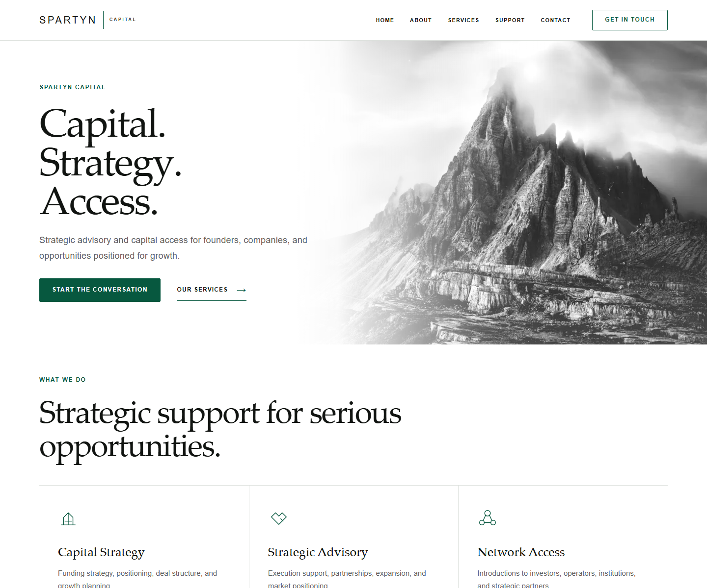
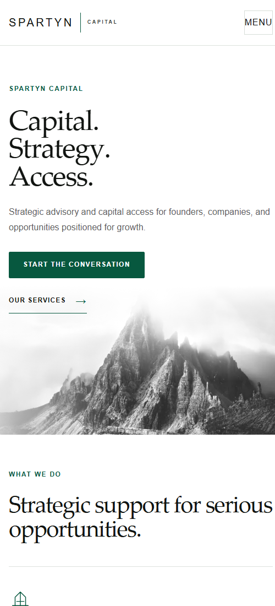
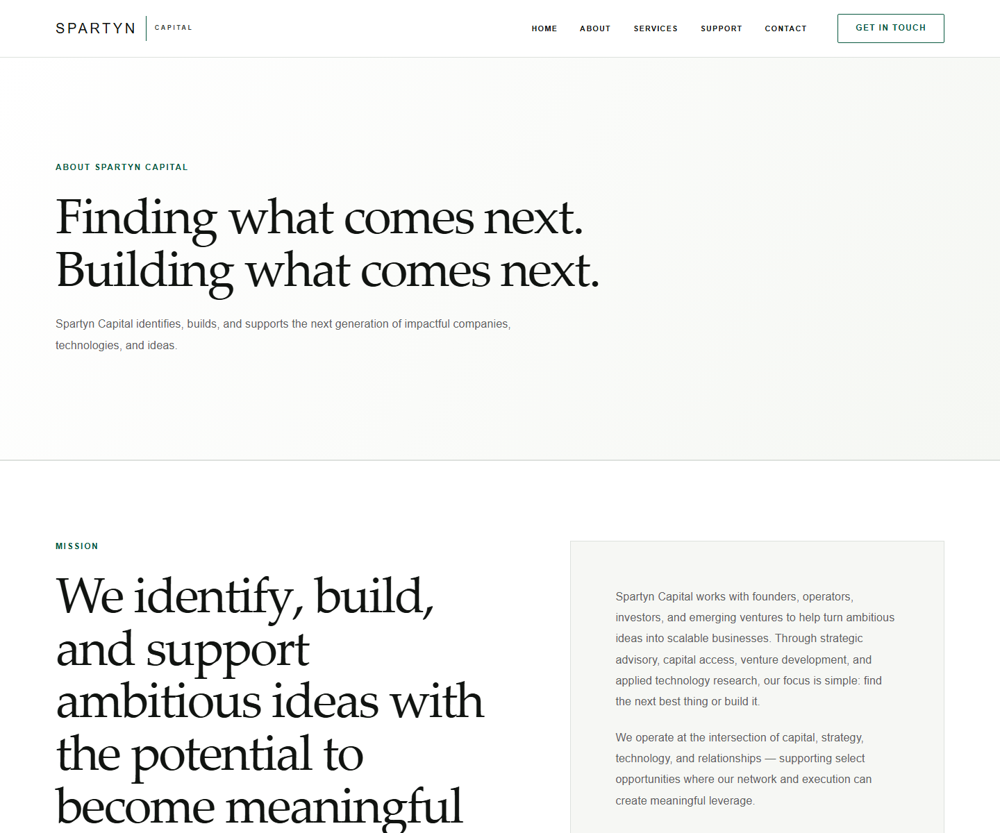

# Spartyn Capital

Production website for Spartyn Capital, a strategic advisory and capital access firm. The application presents the firm's services, company information, leadership, contact details, support resources, and legal policies through a custom responsive editorial interface.

## Live site

[spartyncapital.com](https://spartyncapital.com)

## Project overview

This repository contains the public Spartyn Capital website. It is built with the Next.js App Router and statically renders the site's public routes, metadata endpoints, shared navigation, reusable editorial sections, and responsive image treatments.

The implementation replaces starter UI with a light institutional design system and supports the complete public route set, including About, Contact, Support, Privacy, Terms, and Data Deletion pages.

## Screenshots

### Homepage



<p align="center">
  
</p>

### About



## Technology

- [Next.js 16.2.7](https://nextjs.org/) with the App Router and Turbopack production build
- [React 19.2.4](https://react.dev/)
- [TypeScript 5](https://www.typescriptlang.org/) in strict mode
- [Tailwind CSS 4](https://tailwindcss.com/) through the PostCSS integration
- ESLint 9 with Next.js Core Web Vitals and TypeScript rules
- Vercel deployment with the production domain `spartyncapital.com`

## Engineering highlights

- Reusable site navigation, logo, footer, contact call-to-action, legal layout, leadership, and image components
- Server-rendered App Router pages with a narrow client boundary for interactive mobile navigation
- Desktop and mobile navigation patterns with Escape-key handling, focus transfer, labeled controls, and body-scroll management
- Responsive editorial layouts driven by shared spacing, typography, surface, border, and color primitives
- Next.js image optimization with responsive `sizes`, fixed aspect ratios, priority loading for the hero, and decorative-image handling
- Adaptive mountain composition using responsive object positioning and restrained atmospheric overlays
- Static metadata, Open Graph configuration, organization structured data, robots rules, and generated sitemap
- Static support, contact, privacy, terms, data deletion, 404, robots, and sitemap routes
- Reduced-motion overrides and consistent `focus-visible` treatments
- Strict TypeScript configuration and production build validation

## Design system

The interface uses a light editorial system designed specifically for the site's advisory context:

- white and warm-neutral surfaces
- black and charcoal typography
- restrained institutional green for actions, labels, focus states, and line details
- editorial serif display type paired with a sans-serif UI and body hierarchy
- fluid type scales built with `clamp()`
- fine borders and separators in place of card-heavy presentation
- shared content widths, spacing rhythms, and responsive grid behavior

## Architecture

```text
app/                 App Router pages, root metadata, global styles, robots, and sitemap
components/          Shared navigation, footer, editorial, legal, media, and CTA components
public/              Local images, favicon, licensing notes, and llms.txt
docs/screenshots/    Current desktop and mobile repository documentation images
next.config.ts       Next.js production configuration
postcss.config.mjs   Tailwind CSS PostCSS integration
```

Pages remain server components by default. Browser state and event handling are isolated to `SiteNav`, keeping the rest of the shared interface server rendered.

## Responsive design

The layout uses fluid display typography, bounded content containers, responsive grids, and mobile-specific composition changes. The desktop hero places copy beside the mountain treatment; smaller viewports stack the copy and image into a deliberate vertical composition. Services, company content, leadership, navigation, calls to action, and footer links also shift from horizontal arrangements to touch-friendly stacked layouts.

Responsive image `sizes`, aspect-ratio containers, and explicit object positioning keep media stable while allowing different desktop and mobile crops.

## Accessibility

Verified accessibility behavior includes:

- semantic landmarks and heading structure
- labeled primary, mobile, and footer navigation
- descriptive link and control names
- keyboard-accessible mobile menu with Escape-key closing and focus transfer
- visible focus outlines and minimum touch-target sizing
- empty alternative text and hidden semantics for decorative mountain photography
- responsive text wrapping and overflow safeguards
- `prefers-reduced-motion` support

## SEO and discoverability

The application includes:

- site-wide title and description metadata
- canonical metadata base for `https://spartyncapital.com`
- Open Graph metadata
- index/follow robots configuration
- generated `/robots.txt` and `/sitemap.xml`
- JSON-LD organization data containing only verified properties
- semantic headings and internal route links
- a public `llms.txt` route summary

## Production

The application is deployed on Vercel and available at [https://spartyncapital.com](https://spartyncapital.com).

For local development:

```bash
npm install
npm run dev
```

The development server is available at `http://localhost:3000` by default.

## Validation

```bash
npm run lint
npx tsc --noEmit
npm run build
```

The repository does not currently define an automated test suite.

## Privacy and security

Local environment files, Vercel metadata, generated build output, TypeScript build information, private key files, and dependency directories are excluded through `.gitignore`. Environment values and deployment credentials are not documented or committed.
